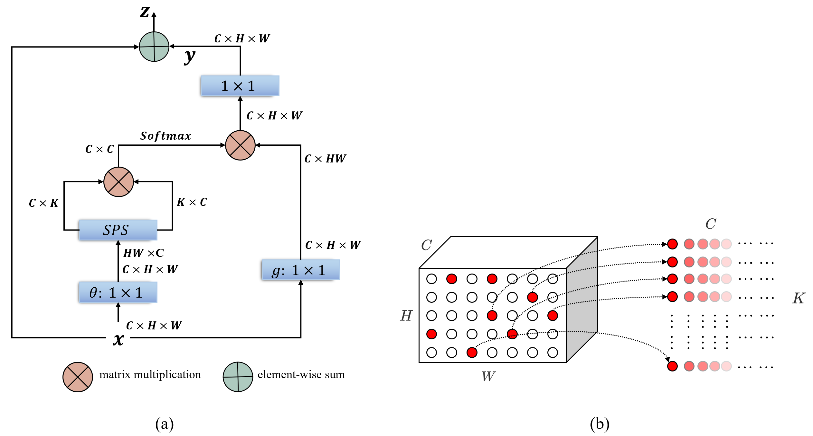

# SPANet
The implementation for "Salient Positions based Attention Network for Image Classification"

arXiv: https://arxiv.org/abs/2106.04996

**A modified version of Non-local, SPANet uses the salient location selection algorithm to select only a limited number of salient regions in the attention map calculation.**

#### ABSTRACT

The self-attention mechanism has attracted wide publicity for its most important advantage of modeling long dependency, and its variations in computer vision tasks, the non-local block tries to model the global dependency of the input feature maps. Gathering global contextual information will inevitably need a tremendous amount of memory and computing resources, which has been extensively studied in the past several years. However, there is a further problem with the self-attention scheme: is all information gathered from the global scope helpful for the contextual modelling? To our knowledge, few studies have focused on the problem. Aimed at both questions this paper proposes the salient positions-based attention scheme SPANet, which is inspired by some interesting observations on the attention maps and affinity matrices generated in self-attention scheme. We believe these observations are beneficial for better understanding of the self-attention. SPANet uses the salient positions selection algorithm to select only a limited amount of salient points to attend in the attention map computing. This approach will not only spare a lot of memory and computing resources, but also try to distill the positive information from the transformation of the input feature maps. In the implementation, considering the feature maps with channel high dimensions, which are completely different from the general visual image, we take the squared power of the feature maps along the channel dimension as the saliency metric of the positions. In general, different from the non-local block method, SPANet models the contextual information using only the selected positions instead of all, along the channel dimension instead of space dimension. The various experiments in CIFAR and Tiny-ImageNet datasets show the proposed method can outperform the non-local block even with a far smaller affinity matrix, especially when they are used in the low network levels. 